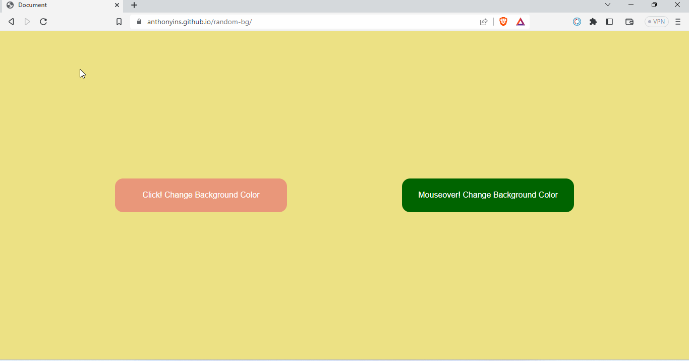

<h1 style="color:red;text-align:center;"> Change Random Background Color App</h1>

## Beklenenler
- İki adet buton oluşturulması ve bu butonlara event tanımlanması.
- Butonlardan biri tıklanınca tetiklenecek, diğeri ise üzerine gelindiğinde tetiklenecek.
- Kullanıcı butona her tıkladığında veya diğer butonun üzerine geldiğinde sayfanın arka plan rengi <b>random</b> değiştirilecek.
- Yine aynı şekilde sayfa her açıldığında da başlangıç arka plan rengi random bir şekilde oluşturulacak.

### Bonus
- Her renk değişiminde oluşan rengin bilgilerinin ekranda gösterilmesi.

