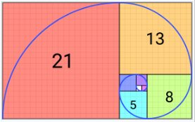
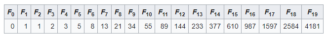

Clarusway

# JS-CC-01 : Fibonacci Number

Purpose of the this coding challenge is to write a code that given a number, returns the corresponding Fibonacci number.

You can find detailed explanation about Fibonacci Sequence [here](https://en.wikipedia.org/wiki/Fibonacci_sequence) 

## Learning Outcomes

At the end of the this coding challenge, students will be able to;

- analyze a problem, identify and apply programming knowledge for appropriate solution.

- demonstrate their knowledge of algorithmic design principles by using JavaScript effectively.

## Problem Statement

- Create a JS code that, given a number from user, returns the corresponding Fibonacci number.

  - The Fibonacci numbers may be defined by the recurrence relation 
      F0= 0, F1= 1, 
    and 
      Fn= Fn-1 + Fn-2 
    for n > 1.

    Under some older definitions, the value of F0= 0 is omitted, so the sequence starts with F1 = F2 = 1 , and the recurrence Fn= Fn-1 + Fn-2 is valid for n > 2 .

    The first 20 Fibonacci numbers  Fn are:

- Examples:

  - If the user enter `9` you should calculate the 9th number and return ➞ `34`

  - If the user enter `17` you should calculate the 17th number and return ➞ `1597`

  - If the user enters `0` or a `negative` number, you should warn them and ask them to enter a number greater than `0`.

 &#8987; <strong> Happy Coding </strong>  &#9997; 

